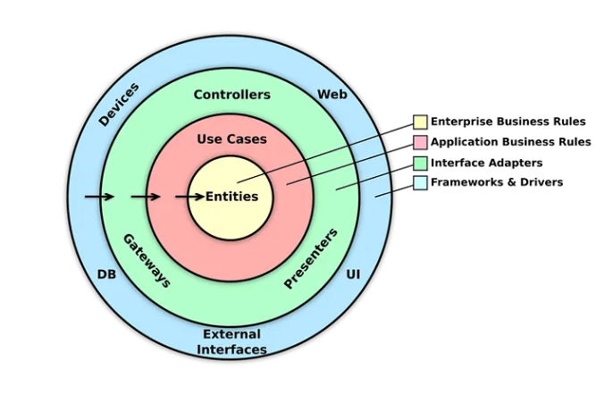
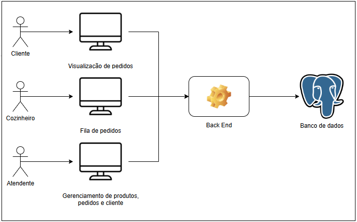
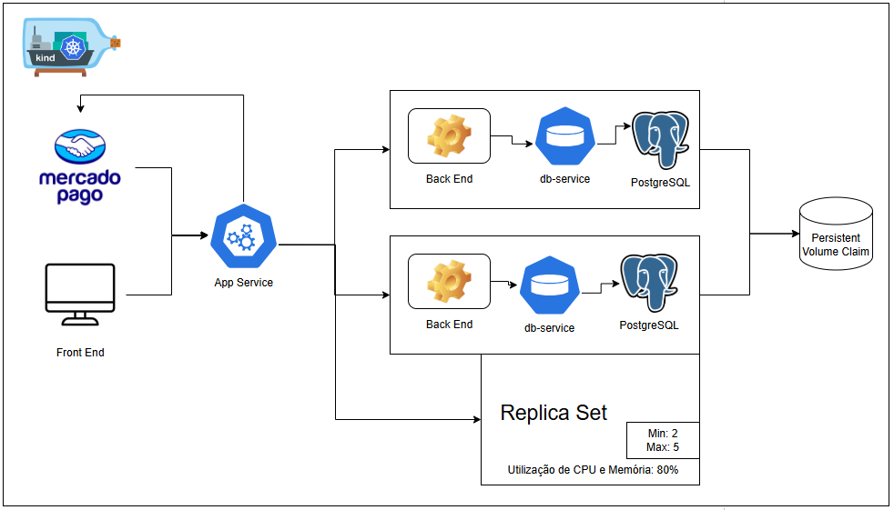
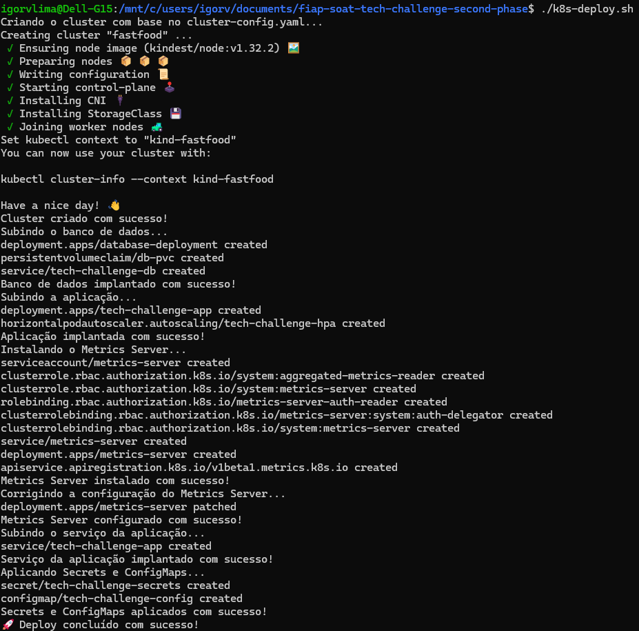
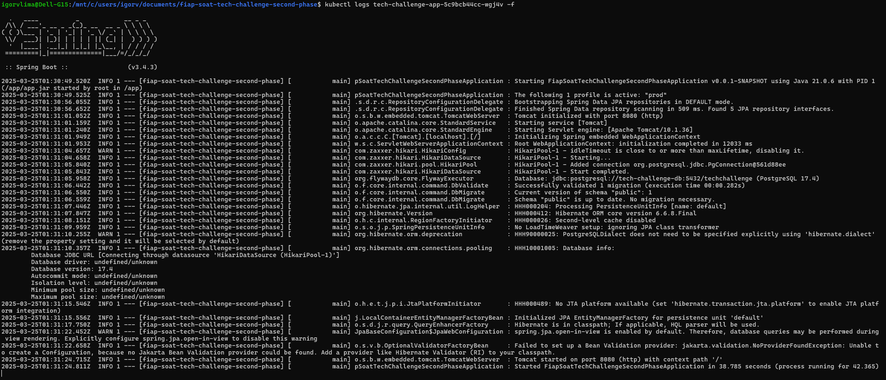

# Tech Challenge - Pós-Tech SOAT - FIAP

Este é o projeto desenvolvido durante a fase II do curso de pós-graduação em arquitetura de software da FIAP - 2024.

A fase I pode consultada pelo link: https://github.com/igorvlima/fiap-soat-tech-challenge-first-phase

Membro do grupo: Igor Veras Lima - RM360611

## Descrição

Este código se trata de um sistema monolítico encarregado de gerenciar a criação de pedidos em um restaurante. Ele processa os pedidos, administra os pagamentos e envia as solicitações para a cozinha assim que o pagamento é confirmado. 

## Tecnologias Utilizadas


## Arquitetura

O projeto segue a estrutura da Arquitetura Limpa, permitindo maior flexibilidade e facilidade de manutenção.



Além disso, dada a arquitetura problema:



foi elaboarada a seguinte arquitetura com Kubernetes:



## Problema

Há uma lanchonete de bairro que está se expandindo devido seu grande
sucesso. Porém, com a expansão e sem um sistema de controle de pedidos, o
atendimento aos clientes pode ser caótico e confuso. Por exemplo, imagine que
um cliente faça um pedido complexo, como um hambúrguer personalizado com
ingredientes específicos, acompanhado de batatas fritas e uma bebida. O
atendente pode anotar o pedido em um papel e entregá-lo à cozinha, mas não
há garantia de que o pedido será preparado corretamente.
Sem um sistema de controle de pedidos, pode haver confusão entre os
atendentes e a cozinha, resultando em atrasos na preparação e entrega dos
pedidos. Os pedidos podem ser perdidos, mal interpretados ou esquecidos,
levando à insatisfação dos clientes e a perda de negócios.
Em resumo, um sistema de controle de pedidos é essencial para garantir
que a lanchonete possa atender os clientes de maneira eficiente, gerenciando
seus pedidos e estoques de forma adequada. Sem ele, expandir a lanchonete
pode acabar não dando certo, resultando em clientes insatisfeitos e impactando
os negócios de forma negativa.
Para solucionar o problema, a lanchonete irá investir em um sistema de
autoatendimento de fast food, que é composto por uma série de dispositivos e
interfaces que permitem aos clientes selecionar e fazer pedidos sem precisar
interagir com um atendente.

## Desenvolvimento

- **[Java 21](https://docs.oracle.com/en/java/javase/21/)**: Documentação do Java 21.
- **[Gradle 8.11.1+](https://docs.gradle.org/current/userguide/userguide.html)**: Documentação do Gradle.
- **[Docker](https://docs.docker.com/?_gl=1*v1gqy4*_gcl_au*MTM4MjU0MTI3Ni4xNzM3NDg2MzY2*_ga*MzMxMDkxMTA1LjE3Mzc0MTQ5OTI.*_ga_XJWPQMJYHQ*MTczNzQ4NjI1MC4zLjEuMTczNzQ4NjM2Ni41OS4wLjA.)**: Documentação do Docker.
- **[Docker Compose](https://docs.docker.com/compose/)**: Documentação do Docker Compose.
- **[Kubernetes](https://kubernetes.io/docs/home/)**: Documentação do Kubernetes.

## Execução

Para executar esse projeto, basta clonar o repositório:

```bash
git clone https://github.com/igorvlima/fiap-soat-tech-challenge-second-phase
```

Após isso, realizar as instalações:

1. Instale o docker: https://www.docker.com/products/docker-desktop/
2. Instale o kind: https://kind.sigs.k8s.io/
3. Instale o kubectl: https://kubernetes.io/pt-br/docs/tasks/tools/

4. Após realizar as instações, acesse o diretório que foi clonado e execute os seguintes comandos:

```bash
chmod +x deploy.sh
```

```bash
./k8s-deploy.sh
```
Com isso a aplicação criará o container e iniciará corretamente.







5. A aplicação estará disponível no endereço: http://localhost:30000

Com esses passos, a aplicação estará configurada e funcionando para receber chamadas! 🎉

⚠️ Observação: Este projeto utiliza o Flyway para gerenciamento de migrações no banco de dados. Isso significa que, ao iniciar a aplicação, todas as tabelas necessárias serão criadas automaticamente com base nos scripts de migração localizados no diretório classpath: `resources/db/migration` Dessa forma, não é necessário executar nenhum comando manual para configuração inicial do banco de dados.

## Criação de pedidos/ Fake Checkout

Para criar um pedido, siga os passos abaixo:

1. Criar um produto

Primeiro, faça uma requisição ao endpoint `/product` para cadastrar um produto. O payload da requisição deve seguir o formato abaixo:

```json
{
  "name": "string",
  "price": 0,
  "description": "string",
  "category": "LANCHE",
  "active": true,
  "images": [
    {
      "url": "string"
    }
  ]
}
```

Após a criação do produto, o sistema retornará o `id` do produto cadastrado, que será necessário para criar o pedido.

2. Criar um pedido

Com o `id` do produto em mãos, faça uma requisição ao endpoint `/order` utilizando o seguinte payload:

```json
{
  "customerId": 0,
  "waitingTimeInMinutes": 0,
  "paymentType": "PIX",
  "items": [
    {
      "productId": 0,
      "quantity": 0
    }
  ]
}
```

3. Mover pedido para pago

Com o id do pedido criado, vamos simular um pagamento. Faça uma requisição no endpoint: 

```bash
/order/{orderId}/payment/APPROVED
```

Dessa forma, o pedido ficará com o status de RECEBIDO, indicando que o pedido e o pagamento foram registrados com sucesso e o pedido está pronto para ser processado pela equipe da cozinha.

## Documentação/Swagger

Link para acessar ao swagger após subir a aplicação:

```bash
http://localhost:30000/swagger-ui.html
```
